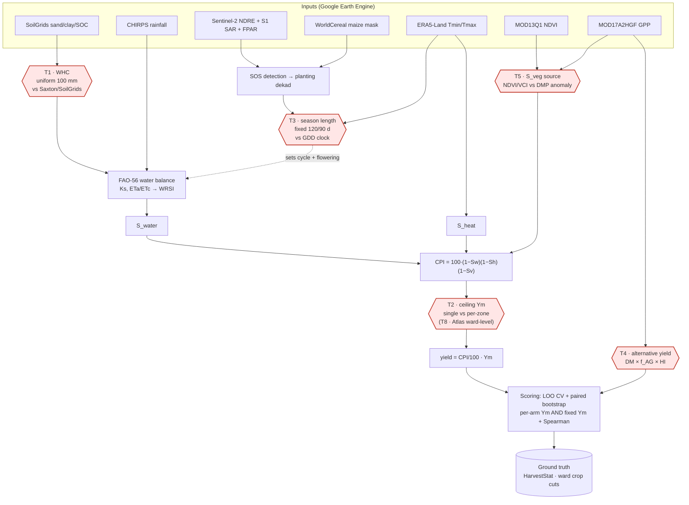

# Methodology Testing — Algorithms, Formulas, Results

**Scope:** five controlled experiments on the ICPAC planting/CPI pipeline, run 2026-09-02/03.
**Reference implementation:** maize 2024 — Kenya (Long rains, Short rains) and Ethiopia (Meher).
**Engine:** Google Earth Engine (server-side) + local Python scoring.
**Companion notebooks:** `Methodology_Testing/0{1..5}_*.ipynb` (regenerate with `build_methodology_colabs.py`).

Every experiment isolates ONE component, holds the rest identical, and scores the result against
independent ground truth. Where a test overturned an existing pipeline claim, the superseded
document is named.

---

## 1. Why the scoring method changed

All earlier pipeline A/Bs were decided on **one 70/30 split** at n ≈ 45. Resampling that protocol
500 times gives a held-out MAE standard deviation of **±0.10 t/ha** — *larger than every effect
these tests measure* (range across seeds: 0.342–0.884 for a single arm). A single split is
therefore not a measurement; it is a draw.

Three consequences, applied throughout:

**(a) Leave-one-out cross-validation.** Every free parameter is refit on n−1 units and the held-out
unit predicted:

```
for i in 1..n:   Ym_(i) = argmin_Ym  Σ_{j≠i} (Ym·x_j − y_j)²  =  Σ_{j≠i} x_j y_j / Σ_{j≠i} x_j²
                 ŷ_i    = Ym_(i) · x_i
LOO-MAE = (1/n) Σ_i |ŷ_i − y_i|
```

This is the standard leave-one-out estimator [Stone 1974], and it is what makes a 2-parameter arm
pay for its extra degree of freedom against a 1-parameter arm.

**(b) Paired bootstrap on the LOO errors.** Zones are resampled with replacement 2000×, both arms
scored on the *same* resample, and the CI taken on the difference [Efron & Tibshirani 1993]:

```
Δ_b = mean|ŷ^A − y|_(b) − mean|ŷ^B − y|_(b)          b = 1..2000
CI  = [percentile(Δ, 2.5), percentile(Δ, 97.5)]      "significant" ⇔ CI excludes 0
```

**(c) Rank metrics reported alongside MAE.** Spearman ρ is invariant to any positive scaling, so it
cannot be manufactured or destroyed by the yield ceiling Ym. In this round, **ρ was the only metric
that survived every trap** — see §2 and §7.

---

## 1b. Illustrative workflow — what each test intervenes on

The pipeline is a chain from satellite cues to a yield number. Each experiment swaps exactly one
box (red) and re-scores the same endpoint against the same ground truth.



| test | box swapped | outcome |
|---|---|---|
| T1 | soil bucket | null; uniform better for failure detection (§3) |
| T2 | Ym structure | per-zone Ym kept — on ranking, not MAE (§4) |
| T3 | season length | fixed 120 d wrong by +68 d in the long-rains highland (§5) |
| T4 | whole yield path | DMP out-ranks CPI in 4/5, cannot see ASAL failure (§6) |
| T5 | vegetation term | rejected — no rank gain anywhere (§7) |
| T8 | ceiling source | Atlas corroborates the AEZ split; use pattern, not level (§8) |

---

## 2. The Ym trap (read before interpreting any MAE below)

The CPI yield is a product of a relative index and a ceiling:

```
CPI  = 100 · (1 − S_water)(1 − S_heat)(1 − S_veg)                      [multiplicative stress]
yield = (CPI/100) · Ym                                                  [Ym = attainable ceiling]
```

If an experiment refits **Ym separately per arm**, then any treatment whose effect is a *level
shift* in CPI is absorbed exactly by the refit and becomes invisible. Several treatments tested
here are predominantly level shifts (a bigger soil bucket raises CPI everywhere; a different
vegetation source shifts mean stress). Therefore every A/B is scored **twice**:

| regime | Ym | what it answers |
|---|---|---|
| per-arm | refit for each arm | "given each arm its best ceiling, which ranks/fits better?" |
| `prod` | the shipped `cpi.ym_for()` | "which is better in the product as it actually ships?" |
| `fit_A` / `fit_B` | one arm's Ym applied to both | brackets the answer; a win under the arm chosen to flatter the *opponent* is a real win |

**This distinction reversed a result** (§3) and explains a spurious one (§7).

---

## 3. Test 1 — Soil water-holding capacity: uniform vs SoilGrids

**Question.** Does per-pixel root-zone WHC from ISRIC SoilGrids 2.0 texture beat the uniform
100 mm fallback? *(Protocol: `WHC_AB_PROTOCOL.md`; code `whc_ab_test.py`, `whc_ab_variants.py`.)*

**Algorithm.** Field capacity and wilting point are both derived from texture by the Saxton–Rawls
pedotransfer functions [Saxton & Rawls 2006] applied to SoilGrids sand/clay/SOC [Poggio et al. 2021],
then integrated over the rooting depth:

```
θ33  = f_FC(Sa, Cl, OM)        θ1500 = f_WP(Sa, Cl, OM)         (Saxton–Rawls 2006, Table 1)
AWC(z) = max(θ33(z) − θ1500(z), 0)
WHC   = Σ_layers AWC(z) · Δz · 10          [mm, Δz in cm, over 0…root_depth]
```

The bucket then drives the FAO-56 water balance [Allen et al. 1998] and WRSI [Verdin & Klaver 2002]:

```
TAW = WHC ,  RAW = p·TAW  (p = 0.55 maize)
Ks  = 1 if Dr ≤ RAW else (TAW − Dr)/(TAW − RAW)
ETc = Kc·ET0 ,  ETa = Ks·ETc
Dr(t) = clamp(Dr(t−1) + ETa − P, 0, TAW)
WRSI = 100 · ΣETa / ΣETc
```

**Result.** Per-arm Ym found one win (KE short rains, Δ +0.046, CI [+0.006,+0.085]). **It did not
survive a shared ceiling** (Δ +0.010, CI spanning zero in all three fixed regimes) — the "win" was
arm B being granted its own better-fitting Ym.

| variant | n | per-arm Δ(A−B) | fixed-Ym Δ(A−B) | verdict |
|---|---|---|---|---|
| KE Long, county | 44 | +0.010 [−0.060,+0.071] | −0.024 [−0.076,+0.023] | null |
| KE Short, county | 46 | **+0.046 [+0.006,+0.085]** | +0.010 [−0.049,+0.066] | **does not survive** |
| KE Short, ward 2021 | 66 | −0.000 | −0.082 [−0.101,−0.064] | uniform better |
| KE Short, ward 2022 (Kitui) | 15 | +0.006 | **−0.318 [−0.384,−0.240]** | uniform much better |
| ET Meher, region | 6 | +0.002 | −0.006 | arms identical |

**Operationally decisive finding.** Kitui short rains 2022 was a near-total failure (all 15 wards
< 0.15 t/ha). The uniform bucket flags **14/15** wards as severe (CPI < 25); SoilGrids flags
**5/15**. The larger bucket buffers the model against a drought that actually happened.

**Where the bucket cannot matter at all.** In Ethiopia Meher, flowering WRSI is 99.5–100 under both
arms — the balance is never water-limited, so bucket size is arithmetically irrelevant. Do not
re-run this test for Meher.

**Recommendation.** Keep SoilGrids/Saxton as the default on physical-realism grounds (per-pixel TAW
is the defensible physics and costs nothing), but state that it is **not skill-validated**, and do
not cite the short-rains MAE as evidence.

---

## 4. Test 2 — Re-check of the LGP and AEZ-Ym A/Bs

**Question.** Both were decided on one 70/30 split (test n = 14). Do they survive LOO?
*(Supersedes the precision claimed in `Cropyield-Data/lgp_ab_test_MAM.md`; code `lgp_ym_ab_recheck.py`.)*

Two *different* failure modes: the LGP arm refits Ym per arm (level blindness, §2); the AEZ-Ym arm
fits **two** free parameters against one (degrees of freedom).

| arm | params | LOO MAE | Pearson | Spearman |
|---|---|---|---|---|
| A fixed 120 d, single Ym | 1 | 0.601 | +0.642 | +0.725 |
| B1 zone-aware LGP | 1 | 0.684 | +0.497 | +0.525 |
| B2 per-zone Ym (3.7 / 2.3) | 2 | **0.537** | **+0.780** | **+0.830** |

**LGP verdict confirmed — keep the fixed 120 d.** B1 loses on MAE and collapses the ranking, and the
rank half of the verdict is Ym-invariant, so the refit trap never applied to it. Across 500 seeds B1
beats A in only 10%.

**AEZ-Ym: right decision, wrong evidence.** Δ MAE +0.063, CI [−0.046,+0.167] — **not significant**
once the second parameter is paid for. But the out-of-sample *ranking* gain is real
(Spearman 0.725 → 0.830), and rank gain is not a degrees-of-freedom artifact. Keep `YM_HIGHLAND`;
justify it by ranking, not MAE.

`lgp_ab_test_MAM.md` reports 0.568 → 0.472; across 500 seeds the means are 0.604 → 0.544 and B2 wins
77% of splits, not all. That table overstates precision.

**Independent corroboration (§8):** the Kenya Insurance Atlas, a wholly separate source, gives a
highland/lowland ceiling of 4.12 / 2.72 t/ha against the fitted 3.7 / 2.3.

---

## 5. Test 3 — Growing period: three definitions, and can the stages be identified?

> **This section supersedes an earlier framing.** The first version of this test compared the
> *configured crop cycle* against *GDD-to-maturity* and called it "LGP". Those are three distinct
> quantities and the pipeline already computes all three. `src/agroecology.lgp_dekads()` implements
> the **FAO growing-period convention (P/PET ≥ 0.5)** — the definition used by FAO/GAEZ
> [FAO 1978; Fischer et al. 2021] and the JRC agro-climatic products — and it should have been the
> benchmark from the outset. Corrected in `lgp_stages_vs_gdd.py`.

| # | quantity | definition | property of |
|---|---|---|---|
| 1 | **Climatic LGP** | dekads with P/PET ≥ 0.5 (FAO/GAEZ/JRC) | the **climate** |
| 2 | Configured crop cycle | `L_ini+L_dev+L_mid+L_late` = 120 d / 90 d | the **configuration** |
| 3 | Thermal requirement | GDD-to-maturity, 1300/1500/1700 °C·d | the **cultivar** |

**Formulas.** Climatic LGP follows the FAO water-balance definition; thermal time uses the capped-mean
form [McMaster & Wilhelm 1997], as in CERES-Maize [Jones & Kiniry 1986; Kiniry & Bonhomme 1991]:

```
LGP  = max run of consecutive dekads with  P/PET ≥ 0.5            [FAO 1978 growing-period convention]
GDD(d)     = max( (min(Tmax,Tcap) + Tmin)/2 − Tbase , 0 )          Tbase 9 °C, Tcap 30 °C
stage(s)   = min{ t : Σ_{SOS}^{t} GDD ≥ frac_s · GDD_maturity }
frac: peak-vegetative 0.45 (VT) · flowering 0.55 (R1) · grain-filling 0.65 (R2/R3) · maturity 1.00
```

### 5.1 The three definitions compared

| season | climatic LGP (pixel-wtd) | configured cycle | GDD requirement | GDD − LGP |
|---|---|---|---|---|
| KE Long rains | 154 d (212) | 120 d | 137 d (173) | −38.9 d |
| KE Short rains | 142 d (168) | 90 d | 104 d (119) | −49.8 d |
| ET Meher | 197 d (177) | 120 d | 142 d (154) | −22.8 d |

By AEZ belt, Kenya long rains:

| | climatic LGP | GDD req | margin | flowering shift |
|---|---|---|---|---|
| highland ≥1800 m (n=14) | mean 196 d, **median 184, range 82–348** | 188 d | mean **+9 d** | +11 d |
| lowland <1800 m (n=30) | mean 135 d, median 87 | 114 d | +21 d | −28 d |

**Read the median, not the mean.** The highland mean margin of +9 d is inflated by a few very wet
counties (LGP up to 348 d). **6 of 14 highland counties have a NEGATIVE margin**, and they are the
core maize counties: Nyandarua −132, Kiambu −94, Nyeri −86, Laikipia −80, Bomet −40, Nakuru −33.
In those counties the thermal requirement genuinely cannot be met inside the moisture window.

### 5.2 Testing the constraint — does the margin predict model error?

The hypothesis: *a cultivar needing more heat-days than the moisture window allows cannot finish on
rainfall, so the model should err where the margin is negative.* Tested directly against the
production CPI yield error across 42 counties:

| statistic | value |
|---|---|
| Pearson r(margin, signed error) | **+0.081** |
| Spearman r(margin, \|error\|) | **+0.097** |
| mean \|error\| where margin < 0 (n=20) | **0.625 t/ha** |
| mean \|error\| where margin ≥ 0 (n=22) | **0.696 t/ha** |
| Mann–Whitney U, H1: error larger when margin < 0 [Mann & Whitney 1947] | **p = 0.715** |

**The hypothesis is not supported.** Error is if anything *slightly smaller* where the thermal
requirement cannot be met. The constraint is descriptively real in the highland core but has **no
measurable consequence for county-scale yield skill**, and does not on this evidence justify a model
change. Recorded because a clean mechanism that fails its test is worth as much as one that passes.

### 5.3 Can the three targeted stages be identified?

**The climatic LGP cannot** — it is an envelope with no internal structure. Stages come either from
fixed Kc fractions of the configured cycle (current pipeline) or from the GDD clock, which resolves
them physiologically. Days after planting:

| season | stage | fixed Kc | GDD clock | shift | inside climatic LGP |
|---|---|---|---|---|---|
| KE Long | advanced vegetative (VT) | 70 | 55 | −15 | — |
| | flowering (R1) | 85 | 70 | −15 | **96%** |
| | grain filling (R2/R3) | 100 | 85 | −15 | **95%** |
| KE Short | advanced vegetative (VT) | 50 | 45 | −5 | — |
| | flowering (R1) | 60 | 56 | −4 | **92%** |
| | grain filling (R2/R3) | 70 | 67 | −3 | **85%** |
| ET Meher | advanced vegetative (VT) | 70 | 54 | −16 | — |
| | flowering (R1) | 85 | 69 | −16 | **100%** |
| | grain filling (R2/R3) | 100 | 85 | −15 | **99%** |

**All three targeted stages are resolvable, and the capability already exists** in
`src/gdd_clock.py` (`STAGE_FRACS`) — it was simply not being exported. Two findings:

1. **Flowering and grain filling fall inside the moisture window in 92–96% of area.** The FAO-33
   Ky = 1.5 critical-window weight [Doorenbos & Kassam 1979] is *not* being applied to a period the
   crop cannot be flowering in. An earlier concern to that effect is resolved negatively.
2. **Short rains stage timing is accurate to within 5 days**, consistent with §5.1 — the 90 d
   configuration matches the thermal reality of its target zone.

> **Correction to an earlier figure.** A highland flowering shift of "+25.9 d" was reported by
> comparing the GDD flowering marker against 70 d = `L_ini + L_dev`, which is the END OF VEGETATIVE
> GROWTH, not flowering. In FAO-56 flowering falls inside `L_mid`, so the correct fixed reference is
> its mid-point (85 d). Against the proper reference the highland shift is **+11 d**. The direction
> holds; the magnitude was overstated.

### 5.5 Independent validation: farmer-reported planting and harvest dates

The Kenya Insurance Atlas records `Plnt_Time` and `Harv_Time` per UAI as free text. Parsed to dekads
(`parse_atlas_season.py`), the difference is an **observed cycle length owing nothing to either
model** — 1,226 UAI parsed (937 long rains, 232 short rains).

| long rains (27 counties, 937 UAI) | cycle length | error vs observed | ρ vs observed |
|---|---|---|---|
| **observed (farmer-reported)** | median 160 d, mean 169 d | — | — |
| GDD clock | mean 151 d | MAE **31 d** | **+0.614** |
| fixed 120 d (production) | 120 d | MAE **54 d**, bias −49 d | 0 by construction |

| by belt | observed | fixed 120 d error | GDD error |
|---|---|---|---|
| highland ≥1800 m (n=11) | 180 d | **−60 d** | **+11 d** |
| lowland <1800 m (n=16) | 145 d | −25 d | −21 d |

**The GDD clock is validated against independent observation and the fixed cycle is not.** GDD roughly
halves the error and, unlike a constant, tracks the spatial pattern (Spearman +0.614). *(The 31 d
figure here is depressed by export-window truncation; with a full window the same clock gives
MAE 23 d — see §5.6, which supersedes the arm-level readings in this section.)* In the
highland — the grain basket — the fixed cycle is 60 days short while GDD is within 11 days. Worst
cases: Nyandarua observed 270 d, Nakuru 240 d, Uasin Gishu 210 d, Trans Nzoia 210 d, all against a
configured 120 d.

**This CORRECTS §5.1's earlier reading.** The short-rains 90 d was previously called "validated"
because it matched the *GDD lowland* figure (90.3 d). Against farmer reports it does not:

| short rains (5 counties, 232 UAI) | cycle length | error |
|---|---|---|
| **observed** | median 130 d, mean 138 d | — |
| GDD clock | 107 d | MAE 31 d |
| fixed 90 d | 90 d | MAE 48 d, bias −48 d |

Machakos 120 d, Kitui 130 d, Bomet 180 d observed against a configured 90 d. Only Makueni (90 d)
matches — the county where farmers deliberately plant drought-escaping short-cycle varieties (§5.4).

**Two caveats that bound the claim.**
1. **Farmer "harvest time" is not physiological maturity.** It typically includes field drying, so the
   observed cycle is an *upper bound* on the crop cycle and part of the +30–50 d gap is drying lag,
   not growth. The direction and the spatial pattern are robust; the magnitude is inflated by an
   unquantified amount.
2. **Parse artefacts remain.** Machakos long rains parses to 330 d, almost certainly a two-season
   string ("long rains ... short rains ..."). Records ≥ 300 d should be reviewed before use.
   Short-rains coverage is thin — 232 UAI but only 5 counties with ≥ 3 records.

**What this settles.** The configured cycle is too short in BOTH Kenyan seasons, materially so in the
highland; the GDD clock is much closer and is the only one of the two that varies spatially. Combined
with §5.2 — where the LGP margin did *not* predict yield error — the case for adopting GDD phenology
rests on **phenological accuracy**, not on a demonstrated yield-skill gain. That distinction should
be stated plainly in any operational proposal.


### 5.6 Full parameterisation decomposition — and a CORRECTION to §5.5

§5.5 compared the GDD clock against the fixed cycle only. With all arms run, that comparison was
incomplete and two of its implications were wrong. Scored against the same farmer-reported cycle
length (`gdd_arms_score.py`), long rains, n = 26–27 counties, observed median 160 d:

| arm | mean | bias | MAE | r |
|---|---|---|---|---|
| fixed 120 d (production) | 120 | −43 | 48 | n/a |
| **CUR — ERA5-Land, Tbase 9, targets 1300/1500/1700** | 156 | **−6** | **23** | **+0.804** |
| TB10 — ERA5-Land, Tbase 10, same targets | 171 | +9 | **22** | +0.810 |
| TAB — ERA5-Land, Tbase 10, operational table 1030/1300/2020 | 182 | +20 | 34 | +0.792 |
| CHIRTS — Tbase 10, operational table | 145 | −17 | 34 | +0.785 |

| isolated effect | Δ MAE | 95% CI | verdict |
|---|---|---|---|
| Tbase 9 → 10 | +0.8 d | [−4.8, +6.2] | no significant difference |
| targets old → operational table | **−11.9 d** | **[−19.9, −3.1]** | **old targets significantly BETTER** |
| ERA5-Land → CHIRTS | −0.4 d | [−14.5, +14.9] | no significant difference |
| fixed → CHIRTS (total) | +12.9 d | [−4.6, +31.5] | not significant |

**Three corrections to what §5.5 implied.**

1. **The existing GDD clock is already well calibrated.** ERA5-Land with Tbase 9 and the current
   1300/1500/1700 targets reproduces farmer-reported cycle length with MAE **23 d** and r **+0.80**.
   The fixed 120 d cycle is the broken component (MAE 48 d); `gdd_clock.py` as it stands is not.
2. **The operational table's targets make it significantly WORSE** — Δ −11.9 d, CI excluding zero,
   losing in 100% of bootstrap resamples. The late target of 2020 °C·d over-shoots: bias moves from
   −6 d to +20 d. Short rains agrees directionally (CUR MAE 17 vs CHIRTS 26, CI excludes zero, n=5).
3. **Neither Tbase nor the CHIRTS temperature source makes a measurable difference at county scale.**
   Both CIs span zero comfortably. An earlier claim that CHIRTS "halves the error and is decisively
   best" was made against the FIXED cycle only, before the ERA5 arms existed, and does not survive
   the full comparison.

**Methodological note.** The "GDD MAE 31 d" reported in §5.5 was itself depressed by export-window
truncation (`dk_hi = se + 20` cut off maturity for slow-accumulating highland pixels). At
`se + 24` the same clock gives MAE 23 d. Part of what looked like model error was the window.

**Two caveats bounding the above.** (a) The CHIRTS arm used **observed** variety classes from the
Insurance Atlas while the ERA5 arms used the AEZ proxy, so `ERA5 → CHIRTS` confounds temperature
source with class source — though since CHIRTS and TAB tie at MAE 34, the class difference is not
rescuing it. (b) Ground truth is farmer-reported harvest, which includes field drying, so arms that
run LONG are flattered; that makes the table's +20 d over-prediction worse than it appears, not better.

**Revised recommendation: keep `gdd_clock.py` as it is and replace the fixed-cycle assumption.**
The 120 d configuration costs 48 days of error; the existing clock recovers most of it. Adopt the
operational table's *stage structure* (class-specific fractions, §5.4) only if re-tested — its
maturity targets did not validate here.

### 5.4 Does a variety-based GDD table beat the AEZ proxy?

`gdd_clock.gdd_maturity_from_aez()` seeds the maturity target from a **proxy** (LGP + elevation →
class → 1300/1500/1700 °C·d); it never sees the cultivar actually grown. The Kenya Insurance Atlas
records `Var_Grown` per ward, so the proxy can be tested against observation.

`config/maize_variety_gdd.csv` — an editable decision table mapping variety strings to maturity class
and GDD target, with a confidence flag (H/M/L). Kenyan hybrid series follow a well-established
altitude/maturity convention [Jaetzold et al. 2006–2012; Hassan 1998; De Groote et al. 2005]:
H6-series highland late, H5-series medium, DH/Katumani/KS20 dryland early. **87% of 1,390 UAI records
match; 525 wards receive a variety-derived class.**

| AEZ proxy → | obs early | obs medium | obs late |
|---|---|---|---|
| **early (1)** | 1 | 2 | 0 |
| **medium (2)** | 1 | 6 | 3 |
| **late (3)** | 0 | 3 | 14 |

**The proxy agrees in only 21/30 counties (70%), and the failures are systematic:**

- **Under-calls in cold highlands.** The rule requires LGP ≥ 12 dekads *and* cool for the late class.
  Nyandarua (2541 m, LGP 100 d = 10 dekads) falls to medium (1500 °C·d) while farmers plant
  H614/H6213 (1700 °C·d). Same for Nyeri and Laikipia — i.e. the proxy *under*-states the thermal
  requirement in precisely the counties where the §5.1 margin is already most negative.
- **Over-calls in bimodal western Kenya.** `lgp_dekads` returns a 320–334 day max-run for Homa Bay,
  Siaya and Busia — that is not one growing season; the max-run rule is merging the two rainy seasons
  despite the docstring's stated intent. Those counties are assigned the late class while farmers
  grow 5-series medium.
- **Makueni: proxy = medium, observed = early** (KS20/Katumani drought-escaping). The pipeline has a
  recorded history of badly missing Makueni; assigning a medium-cycle thermal requirement where
  farmers deliberately plant a drought-escaping short cycle is a plausible contributor.

**Recommendation.** Replace the AEZ proxy with the variety table where `Var_Grown` exists, and fall
back to the proxy elsewhere. Separately, the bimodal max-run defect in `lgp_dekads` should be fixed
regardless — a 334-day "growing period" is wrong under the FAO definition it implements.

## 6. Test 4 — DMP biomass yield vs the CPI water-balance yield

**Question.** How does a yield built from dry-matter productivity compare with the CPI yield against
the same ground truth? *(Code `src/dmp_yield.py`, `dmp_run.py`, `dmp_score.py`.)*

**Data note.** Copernicus CGLS DMP is **300 m / 1 km, not 250 m**, and is **not in the GEE catalog**
(it is distributed via land.copernicus.eu / Terrascope; the CDSE OData catalogue serves Sentinel
missions and CCM, not CLMS land products). MODIS **MOD17A2HGF** stands in — gap-filled, 2000–2025
[Running et al. 2004; Zhao et al. 2005], the algorithm being Monteith light-use efficiency
[Monteith 1972]. `--source modis|cgls` is a one-flag swap.

```
DMP  = GPP · CUE / C_frac / days                    [kg DM ha⁻¹ d⁻¹]   CUE = 0.45, C_frac = 0.475
DM_season = Σ_composites DMP · days                 [kg DM ha⁻¹]  integrated over planting→+LGP
grain = DM_season · f_AG · HI / (1 − moisture)      f_AG = 0.80, HI = 0.45, moisture = 0.135
```

Raw `DM_kg_ha` is exported, so HI / f_AG / moisture are applied at scoring time and retune with no
re-export. Harvest index for cereals: [Hay 1995]. Dekads are 8–11 days, not a flat 10 — `dekad_to_t()`
uses the real calendar.

**Result (gap-filled MOD17A2HGF).**

| variant | n | DMP MAE / bias / ρ | CPI MAE / bias / ρ | implied HI | over-pred |
|---|---|---|---|---|---|
| KE Long 2024 | 42 | 1.109 / +1.059 / **+0.72** | 0.669 / +0.067 / **+0.72** | 0.272 | 1.7× |
| KE Short 2024 | 46 | 0.721 / +0.638 / **+0.63** | 0.517 / +0.064 / +0.59 | 0.290 | 1.5× |
| KE ward 2021 | 66 | 1.324 / +1.324 / **+0.39** | 1.254 / +1.223 / +0.15 | 0.071 | 6.7× |
| KE ward 2022 (Kitui) | 15 | 1.343 / +1.343 / **+0.36** | 0.536 / +0.536 / **−0.32** | 0.021 | 21.7× |
| ET Meher 2024 | 6 | **0.536 / −0.396 / +0.60** | 1.575 / +1.575 / **−0.40** | 0.482 | 0.8× |

**DMP out-ranks the CPI water balance in four of five** — everywhere except Kenya long rains, where
it ties (ρ 0.72 vs 0.72, CPI ahead on Pearson). The advantage is largest exactly where CPI ranks
*backwards*: Kitui 2022 (−0.32) and Ethiopia (−0.40).

**The implied harvest index is a diagnostic, not a calibration knob.** Back-solving the HI that would
reproduce the observations:

```
HI_implied = Σ(d·y) / Σ(d²)  ,   d = DM · f_AG / (1 − moisture) / 1000
```

Ethiopia gives **0.468** — squarely inside the agronomic 0.30–0.55 range [Hay 1995], i.e. the whole
chain is internally consistent there. Kenya gives 0.272 / 0.290, *below* range; at ward level 0.071
and 0.021, physically impossible. No harvest index reconciles those, so the error is not in the
conversion — it is **mixed pixels**: smallholder 500 m pixels carry bush, weeds and intercrop biomass
that grows whether or not the maize does. Hence DMP over-predicts the Kitui total failure by 21.7×.

**How to register DMP — it measures the OUTCOME, not the CAUSE.**

| role | instrument |
|---|---|
| causal attribution + lead time | WRSI water balance (`S_water`), heat (`S_heat`) — keep |
| outcome ranking, late-season estimate | DMP |
| divergence as a diagnostic | DMP high + balance stressed → suspect mask/irrigation; DMP low + balance fine → suspect heat, pest, nutrient |

DMP cannot attribute *why* biomass is short, it lags (the shortfall appears after the stress, too
late for anticipatory action), and it cannot see failure in mixed pixels. It is an independent
cross-check, **not** a replacement for the stress terms — and, per §7, not an improvement inside them.

---

## 6b. Division of labour: LGP, the GDD clock, and NDVI

A recurring question is whether the three agro-climatic products are alternatives. They are not —
they answer different questions, and only one of them can run **forward in time**.

### Why forecasting requires the thermal clock, not the observation

Crop phenology is driven by thermal time, and a thermal model is *prognostic*: given a planting date
and a temperature series (forecast, or climatological normal), it projects the date of each stage
**before that stage occurs**. This is the basis of every operational crop simulator — CERES-Maize
[Jones & Kiniry 1986], the stage-partitioning conventions in [Kiniry & Bonhomme 1991] and
[Ritchie & NeSmith 1991], the GDD formulations reviewed by [McMaster & Wilhelm 1997], and the
APSIM framework [Holzworth et al. 2014]. Seasonal yield forecasting reviews treat model-based
phenology as the prerequisite for in-season prediction [Basso & Liu 2019].

A vegetation index is *diagnostic*: NDVI reports canopy state that has **already** happened. It can
detect an anomaly and it can predict yield **once enough of the season has elapsed** — the
established remote-sensing yield forecasts are explicitly mid-season-onward and phenologically
tuned [Funk & Budde 2009; Becker-Reshef et al. 2010; Rembold et al. 2013] — but it cannot place a
flowering window that has not occurred yet. For anticipatory action, which needs lead time *before*
the critical window, an index alone is structurally unable to deliver it.

Three measurements in this repository agree with that reasoning:
- **§5.3** — the GDD clock resolves advanced-vegetative, flowering and grain-filling in all three
  seasons; the climatic LGP resolves **none** of them.
- **§5.5/§5.6** — a GDD clock reproduces farmer-reported cycle length (MAE 23 d, r +0.80) where the
  fixed cycle does not (MAE 48 d). NOTE: the *existing ERA5-Land* parameterisation achieves this;
  CHIRTS showed no significant improvement over it at county scale (§5.6).
- **§7** — substituting an NDVI-family product into the CPI vegetation term produced **no rank skill
  gain in any season** (Ethiopia admin-2, n=39: ρ ≈ 0 for both arms).

### The role of LGP

LGP is not a phenology model and should not be asked to behave like one. In the FAO/GAEZ framework
it is an **agro-climatic screening variable**: the length of the period when moisture (and, in the
full definition, temperature) permit crop growth [FAO 1978; Fischer et al. 2021]. It is used to
decide *what can be grown where* and to stratify zones — as in continental impact assessments that
use LGP as the primary agro-climatic axis [Jones & Thornton 2003] — not to time stages within a
season. It is an **envelope**, and an envelope has no interior structure.

So the correct division is:

| question | instrument |
|---|---|
| *Can this crop/cultivar be grown here at all?* | LGP (agro-climatic screening) |
| *When will each stage occur — before it occurs?* | GDD clock (prognostic) |
| *How much water/heat stress inside each stage?* | CHIRPS balance + CHIRTS, stage-weighted by Ky |
| *Did the canopy actually behave as modelled?* | NDVI (diagnostic, confirmation, anomaly) |

### 6b.1 A crop-relevant LGP — `crop_lgp.py`

The pipeline's existing `agroecology.lgp_dekads` is season-agnostic: a max run of P/PET ≥ 0.5 dekads
over a climatology, which in bimodal climates merges the two rainy seasons (Homa Bay 334 d, Siaya
320 d — see §5.4). Anchoring on the **modelled planting dekad** makes that impossible and yields a
per-pixel, per-year quantity bounded by whichever constraint binds first:

```
MOISTURE end  SW(t) = clamp( SW(t-1) + P(t) − ETc(t), 0, WHC )
              water_end = first dekad after planting with SW = 0 AND P < 0.5·PET
              (the FAO convention continues the period past the rains until the store is spent)
THERMAL end   therm_end = first dekad with cumulative GDD ≥ target(maturity class)
LGP_crop      = min(water_end, therm_end) − planting          [days]
binding       = 1 water-limited | 2 thermal-limited
```

The `binding` band is the operationally useful output: it says **which constraint actually ends the
season in each pixel**, which the current single-number LGP cannot express. Temperature is ERA5-Land
in the GEE implementation because CHIRTS in GEE ends in 2016. NOTE: §5.6 found **no significant
difference** between ERA5-Land and CHIRTS for cycle length at county scale, so the CHIRTS ingest is
NOT on the critical path — its argument is grid consistency with CHIRPS and sub-county detail, not
demonstrated accuracy.


### 6b.2 DECISION — thermal end for cycle length, crop LGP for terminal stress

Validated against farmer-reported planting/harvest dates (Kenya Insurance Atlas, n = 26 counties,
long rains, observed median 155 d), with the crop LGP rebuilt on the validated clock:

| estimator | bias | MAE |
|---|---|---|
| **thermal end alone** | **−1 d** | 24 d |
| min(water, thermal) | −11 d | 22 d |
| *(same test on the xlsx targets, for contrast)* | +30 d / +18 d | 39 d / 32 d |

**Cycle length = the thermal end.** It is essentially unbiased; `min()` under-predicts the harvest
date. The reason is behavioural, not physical: **farmers harvest at thermal maturity** — if water
truncates the season they still harvest, just a reduced crop, at roughly maturity timing. So the
observed cycle tracks the thermal end, and taking the minimum pulls the estimate short.

An earlier reading that `min()` beat thermal alone (MAE 32 vs 39) was an artifact of the inflated
xlsx targets, not evidence that water truncation shortens the harvest date.

**Terminal stress = the crop LGP.** Its operational outputs are `binding` (which constraint ends the
season) and `terminal_gap_d` = therm_end − water_end (days by which the moisture window falls short
of maturity). That statement is available BEFORE grain filling begins — the lead time an index
cannot provide.

Wired accordingly: `src/crop_cycle.py` returns the THERMAL end and is what
`run_wrsi_staged(cycle_img=...)` consumes; `crop_lgp.py` carries the moisture constraint and now
exports `terminal_gap_d` explicitly.

**Secondary finding.** On the validated clock the highland water-limited fraction falls from 36% to
**14%** — the highland is far less water-constrained than the first build implied. That first
reading was largely the 2020 °C·d late target inflating the thermal requirement until water appeared
to bind. Nyeri remains the largest exposure (61 d); Laikipia and Narok drop off the list entirely.


---

## 7. Test 5 — S_veg swap: NDVI/VCI vs a DMP anomaly

**Question.** If DMP ranks yield better, does sourcing CPI's *vegetation* term from it help?
*(Code `sveg_swap_run.py`, `sveg_swap_score.py`.)*

`S_water` and `S_heat` are computed once and shared; only the source of `S_veg` differs; `VEG_W` and
the climatology window are matched. The DMP term is an **anomaly**, not raw biomass — mixed-pixel
contamination is largely static per pixel, so differencing against the pixel's own history cancels it:

```
VCI = (X − X_min)/(X_max − X_min)   over clim_years          [Kogan 1995]
S_veg = VEG_W · (1 − VCI)                                     VEG_W = 0.4
   arm V:  X = seasonal peak NDVI (MOD13Q1)
   arm D:  X = seasonal integrated DM (MOD17A2HGF)
```
(the z-score alternative follows the ASAP convention [Rembold et al. 2019]).

| variant | n | V Spearman | D Spearman | Δ LOO-MAE | CI | D better |
|---|---|---|---|---|---|---|
| KE Long 2024 | 43 | +0.737 | +0.754 | +0.014 | [−0.024,+0.054] | 77% |
| KE Short 2024 | 46 | +0.594 | +0.617 | +0.010 | [−0.008,+0.031] | 84% |
| ET Meher, **admin-1** | 5 | +0.100 | +0.700 | +0.075 | [−0.032,+0.185] | 92% |
| ET Meher, **admin-2** | **39** | **+0.006** | **−0.033** | −0.033 | [−0.089,+0.023] | **12%** |

**The swap is rejected.** The apparently large Ethiopian gain at admin-1 was **n = 5 noise**: at
n = 39 (GADM level-2 zones) neither term has any rank skill (ρ ≈ 0 for both) and NDVI is marginally
ahead. Kenya shows negligible rank gain and a worse-centred CPI under the shipped Ym.

**Note what the fixed-Ym column is not.** DMP reads *less* stress than NDVI in Kenya (0.084 vs 0.120)
so CPI rises and bias worsens; it reads *more* in Ethiopia (0.211 vs 0.156) so CPI falls and the known
over-prediction improves (MAE 1.343 → 1.061). That is only whether the shift happens to point at each
country's existing bias — a Ym artifact, not skill. **ρ is the skill statement.**

---

## 8. Ym from the Kenya Agricultural Insurance Atlas

*(Code `build_kenya_atlas_ym.py`; source `~/ICPAC-WORK/KENYA AGRICULTURAL INSURANCE ATLAS DATA/`.)*

1,390 UAI (Unit Area of Insurance) polygons carry annual yield series `Yield_2006…2020` plus
`Var_Grown`, `Plnt_Time`, `Harv_Time`, `Major_Hzds`, keyed to County / Sub-County / **Ward**.

**Units are 90-kg bags per acre**, the standard Kenyan reporting unit — not t/ha:

```
t/ha = bags_per_acre · 90 kg / 0.4047 ha / 1000 = bags_per_acre · 0.22239
```

Median 10.5 bags/acre = 2.34 t/ha, landing on HarvestStat's 2.37 t/ha Kenya ceiling — that agreement
is what confirms the unit. Values > 80 bags/acre are recording errors and are filtered.

Aggregates to **643 wards / 150 sub-counties / 34 counties**.

**Independent corroboration of the AEZ-Ym split** (§4): Atlas p90 ceiling **4.12 t/ha highland vs
2.72 t/ha lowland**, against the independently fitted `YM_HIGHLAND` = 3.7 / 2.3. A separate data
source reproduces both the split and roughly its magnitude.

**Do not substitute Atlas values as Ym directly.** Atlas p90 averages 3.31 t/ha vs HarvestStat 2.76,
correlating r = +0.468 across 31 counties. A UAI is a specifically cropped, insured area and some
carry irrigation (Baringo reads 5.87 vs HarvestStat 2.37 — almost certainly the Perkerra scheme).
Raw substitution would reintroduce the over-prediction the Ym recalibration removed. **Use the Atlas
for the spatial pattern of Ym; anchor the level to HarvestStat** — the yield-gap framing of
[van Ittersum et al. 2013; Lobell et al. 2009], where the ceiling is defined by attainable rather
than observed mean yield.

Unexploited: `Plnt_Time`/`Harv_Time` is independent ward-level ground truth for the planting pipeline
*and* for the 68-day highland LGP discrepancy in §5; `Var_Grown` gives per-ward maturity-class priors
where the GDD clock currently uses an AEZ proxy.

---

## 9. Data-handling pitfalls encountered (all silent, all upstream of the statistics)

Each of these produced plausible-looking numbers from a broken input. They are documented because
the statistics cannot detect them.

| pitfall | symptom | fix |
|---|---|---|
| **GAUL-2015 level 1 for Kenya = 8 old PROVINCES** | export returned 8 rows; scorer would match 1 county | export at level 2, roll up via `src/kenya_gaul_counties.py` (71 districts → 47 counties), **pixel-count weighted** |
| **Drive never overwrites** — re-export lands as `name (1).csv` | a "re-run" returned numbers byte-identical to the run it replaced | `canonicalize_drive_exports.py` — resolve each base name to its newest **Drive** variant, delete local duplicates |
| **MOD17A2H v061 in GEE covers only 2021–2026** | every year of an intended 2015–2023 climatology was empty | use **MOD17A2HGF** (gap-filled, 2000–2025) |
| **Mapped images lose `system:time_start`** | inner `filterDate` matched nothing → zero-band sum → `Image.max: Got 0 and 1` | set it explicitly in the map |
| **GADM ETH "North Shewa" exists in BOTH Amhara and Oromia** | two unrelated zones would merge | key the crosswalk region-qualified (`src/ethiopia_gadm_zones.py`) |
| **GADM 4.1 predates 2018 Ethiopian zone splits** | many-to-one join | aggregate observations as Σproduction/Σarea, never a mean of zone yields |
| **Ethiopia admin-1 has only 5–7 usable regions** | n too small to settle anything; produced one spurious result | score at admin-2 (66 zones) |

---


**CORRECTION (2026-09-04) — the planting-truncation claim below is WITHDRAWN.**
It was benchmarked against the Insurance Atlas `Plnt_Time`, of which **71% of records name a
RANGE** ("March/April", "3rd week of March to 1st week of April") and the parser takes its
**start**. The Atlas therefore reports the earliest edge of a nominal insurance window, not
observed planting. Against the TomorrowNow farmer survey (**4.8M farmers, 2024**), only
**14.9% of ward-median planting falls before the detection window and 85.0% falls inside it** —
the reverse of the Atlas figure. Paired on 368 shared wards the two sources differ by a
systematic **1.46 dekads**.
**The pipeline's planting date is fine**: +0.43 dekads (~4 days early) against the survey, not
1–3 dekads late. Sources compiled in `Cropyield-Data/planting_dates_all_sources_{county,ward}.csv`.
Findings that rest on Atlas *cycle length* (planting→harvest) are unaffected, because a
consistent offset at both ends largely cancels.


---

## 10. References

**Soil hydraulics & water balance**
- Saxton, K.E. & Rawls, W.J. (2006). *Soil water characteristic estimates by texture and organic matter for hydrologic solutions.* Soil Science Society of America Journal 70(5), 1569–1578. https://doi.org/10.2136/sssaj2005.0117
- Poggio, L. et al. (2021). *SoilGrids 2.0: producing soil information for the globe with quantified spatial uncertainty.* SOIL 7, 217–240. https://doi.org/10.5194/soil-7-217-2021
- Allen, R.G., Pereira, L.S., Raes, D. & Smith, M. (1998). *Crop evapotranspiration — guidelines for computing crop water requirements.* FAO Irrigation and Drainage Paper 56.
- Raes, D., Steduto, P., Hsiao, T.C. & Fereres, E. (2009). *AquaCrop — the FAO crop model to simulate yield response to water: II. Main algorithms and software description.* Agronomy Journal 101(3), 438–447. https://doi.org/10.2134/agronj2008.0140s

**WRSI / yield response**
- Verdin, J. & Klaver, R. (2002). *Grid-cell-based crop water accounting for the famine early warning system.* Hydrological Processes 16, 1617–1630. https://doi.org/10.1002/hyp.1025
- Doorenbos, J. & Kassam, A.H. (1979). *Yield response to water.* FAO Irrigation and Drainage Paper 33. (source of the stage Ky used in the CPI stage weighting)

**Phenology & thermal time**
- McMaster, G.S. & Wilhelm, W.W. (1997). *Growing degree-days: one equation, two interpretations.* Agricultural and Forest Meteorology 87(4), 291–300. https://doi.org/10.1016/S0168-1923(97)00027-0

**Vegetation condition & productivity**
- Kogan, F.N. (1995). *Application of vegetation index and brightness temperature for drought detection.* Advances in Space Research 15(11), 91–100. https://doi.org/10.1016/0273-1177(95)00079-T
- Rembold, F. et al. (2019). *ASAP: A new global early warning system to detect anomaly hot spots of agricultural production for food security analysis.* Agricultural Systems 168, 247–257. https://doi.org/10.1016/j.agsy.2018.07.002
- Monteith, J.L. (1972). *Solar radiation and productivity in tropical ecosystems.* Journal of Applied Ecology 9(3), 747–766. https://doi.org/10.2307/2401901
- Running, S.W. et al. (2004). *A continuous satellite-derived measure of global terrestrial primary production.* BioScience 54(6), 547–560. https://doi.org/10.1641/0006-3568(2004)054[0547:ACSMOG]2.0.CO;2
- Zhao, M., Heinsch, F.A., Nemani, R.R. & Running, S.W. (2005). *Improvements of the MODIS terrestrial gross and net primary production global data set.* Remote Sensing of Environment 95(2), 164–176. https://doi.org/10.1016/j.rse.2004.12.011

**Yield formation & yield gaps**
- Hay, R.K.M. (1995). *Harvest index: a review of its use in plant breeding and crop physiology.* Annals of Applied Biology 126(1), 197–216. https://doi.org/10.1111/j.1744-7348.1995.tb05015.x
- van Ittersum, M.K. et al. (2013). *Yield gap analysis with local to global relevance — a review.* Field Crops Research 143, 4–17. https://doi.org/10.1016/j.fcr.2012.09.009
- Lobell, D.B., Cassman, K.G. & Field, C.B. (2009). *Crop yield gaps: their importance, magnitudes, and causes.* Annual Review of Environment and Resources 34, 179–204. https://doi.org/10.1146/annurev.environ.041008.093740

**Climate & land-cover inputs**
- Funk, C. et al. (2015). *The climate hazards infrared precipitation with stations — a new environmental record for monitoring extremes.* Scientific Data 2, 150066. https://doi.org/10.1038/sdata.2015.66
- Muñoz-Sabater, J. et al. (2021). *ERA5-Land: a state-of-the-art global reanalysis dataset for land applications.* Earth System Science Data 13, 4349–4383. https://doi.org/10.5194/essd-13-4349-2021
- Van Tricht, K. et al. (2023). *WorldCereal: a dynamic open-source system for global-scale, seasonal, reproducible crop and irrigation mapping.* Earth System Science Data 15, 5491–5515. https://doi.org/10.5194/essd-15-5491-2023

**Agro-ecological zoning & growing period**
- FAO (1978). *Report on the Agro-ecological Zones Project, Vol. 1: Methodology and Results for Africa.* World Soil Resources Report 48, FAO, Rome. — origin of the Length of Growing Period (LGP) concept and the P/PET ≥ 0.5 moisture-adequacy criterion used in `src/agroecology.lgp_dekads`.
- Fischer, G., van Velthuizen, H., Nachtergaele, F. et al. (2021). *Global Agro-Ecological Zones (GAEZ v4) — Model Documentation.* FAO & IIASA. https://doi.org/10.4060/cb4744en — the current operational LGP/AEZ product against which a pipeline LGP should be benchmarked.

**Maize thermal time & phenology modelling**
- Jones, C.A. & Kiniry, J.R. (1986). *CERES-Maize: A Simulation Model of Maize Growth and Development.* Texas A&M University Press. — thermal-time accumulation and stage partitioning for maize.
- Kiniry, J.R. & Bonhomme, R. (1991). *Predicting maize phenology.* In: Hodges, T. (ed.) *Predicting Crop Phenology*, CRC Press, 115–131. — GDD-to-stage targets and cultivar maturity classes.

**Kenyan maize varieties, maturity classes & agro-ecological matching**
- Jaetzold, R., Schmidt, H., Hornetz, B. & Shisanya, C. (2006–2012). *Farm Management Handbook of Kenya, Vol. II: Natural Conditions and Farm Management Information* (2nd edn). Ministry of Agriculture, Kenya / GTZ. — the standard Kenyan agro-ecological zone reference, including recommended maize maturity class and variety by zone; basis for `config/maize_variety_gdd.csv`.
- Hassan, R.M. (ed.) (1998). *Maize Technology Development and Transfer: A GIS Application for Research Planning in Kenya.* CAB International, Wallingford. — GIS characterisation of Kenyan maize production systems and the altitude/maturity convention of the H5/H6 hybrid series.
- De Groote, H., Owuor, G., Doss, C., Ouma, J., Muhammad, L. & Danda, K. (2005). *The maize green revolution in Kenya revisited.* electronic Journal of Agricultural and Development Economics (eJADE) 2(1), 32–49. — adoption of hybrid maturity classes by agro-ecological zone.

**Prognostic crop phenology & in-season forecasting**
- Ritchie, J.T. & NeSmith, D.S. (1991). *Temperature and crop development.* In: Hanks, J. & Ritchie, J.T. (eds) *Modeling Plant and Soil Systems*, Agronomy Monograph 31, ASA-CSSA-SSSA, 5–29. — thermal time as the driver of stage progression.
- Holzworth, D.P. et al. (2014). *APSIM — evolution towards a new generation of agricultural systems simulation.* Environmental Modelling & Software 62, 327–350. https://doi.org/10.1016/j.envsoft.2014.07.009 — operational framework in which phenology is projected, not observed.
- Basso, B. & Liu, L. (2019). *Seasonal crop yield forecast: Methods, applications, and accuracies.* Advances in Agronomy 154, 201–255. https://doi.org/10.1016/bs.agron.2018.11.002 — review establishing model-based phenology as the prerequisite for in-season forecasting.

**Diagnostic (satellite-index) yield estimation — and its lead-time limits**
- Funk, C. & Budde, M.E. (2009). *Phenologically-tuned MODIS NDVI-based production anomaly estimates for Zimbabwe.* Remote Sensing of Environment 113(1), 115–125. https://doi.org/10.1016/j.rse.2008.08.015
- Becker-Reshef, I. et al. (2010). *A generalized regression-based model for forecasting winter wheat yields in Kansas and Ukraine using MODIS data.* Remote Sensing of Environment 114(6), 1312–1323. https://doi.org/10.1016/j.rse.2010.01.010 — skill emerges only from mid-season onward.
- Rembold, F., Atzberger, C., Savin, I. & Rojas, O. (2013). *Using low resolution satellite imagery for yield prediction and yield anomaly detection.* Remote Sensing 5(4), 1704–1733. https://doi.org/10.3390/rs5041704

**LGP as an agro-climatic screening variable**
- Jones, P.G. & Thornton, P.K. (2003). *The potential impacts of climate change on maize production in Africa and Latin America in 2055.* Global Environmental Change 13(1), 51–59. https://doi.org/10.1016/S0959-3780(02)00090-0 — LGP used as the primary agro-climatic axis for crop suitability, not for stage timing.

**Non-parametric testing**
- Mann, H.B. & Whitney, D.R. (1947). *On a test of whether one of two random variables is stochastically larger than the other.* Annals of Mathematical Statistics 18(1), 50–60. https://doi.org/10.1214/aoms/1177730491 — used in §5.2 to test whether model error is larger where the thermal requirement exceeds the moisture window.

**Statistical method**
- Stone, M. (1974). *Cross-validatory choice and assessment of statistical predictions.* Journal of the Royal Statistical Society, Series B 36(2), 111–147.
- Efron, B. & Tibshirani, R.J. (1993). *An Introduction to the Bootstrap.* Chapman & Hall.

### §6b.3 OND detection window vs CHIRPS / CHIRTS / MODIS phenology normals (2026-09-04)

Closes the gap that §6b.2 left open: the OND window had been validated only against reported planting.
Three climatological anchors, none of which sees the survey, were added. Script: `/tmp/ond_ltn_check.R`
→ `Cropyield-Data/ond_window_ltn_validation.csv`; GEE export `modis_pheno_ond_ke` (MCD12Q2 Greenup_1/2,
2001–2023, ESA WorldCover cropland mask, GAUL L2 → county via `src/kenya_gaul_counties.py`).

| test | early | late | Wilcoxon p | verdict |
|---|---|---|---|---|
| Aug–Sep rainfall (mm, CHIRPS LTN) | 211 | 34 | 0.009 | separates (AUC 0.79) |
| Jul–Sep rainfall (mm) | 280 | 47 | 0.008 | separates |
| pre-season rainfall fraction | 0.40 | 0.11 | 0.011 | separates |
| CHIRPS onset dekad (25/20 mm) | 21 | 29 | 0.030 | separates |
| MODIS 2nd-cycle green-up dekad | 26.5 | 29.0 | 0.019 | separates |
| MODIS 2nd-cycle detection rate | 20% | 35% | 0.029 | separates |
| Oct–Nov rainfall (mm) | 309 | 268 | 0.306 | ns |
| Tmax over OND (°C, CHIRTS LTN) | 29.4 | 31.1 | 0.226 | ns |
| Tmax over Aug–Sep (°C) | 28.5 | 29.6 | 0.611 | ns |
| GDD over OND | 872 | 1014 | 0.396 | ns |

Window coverage: CHIRPS onset inside dk 28–33 in 15/28 counties overall, **13/13** among counties with a
genuine dry break (Aug–Sep < 100 mm); MODIS green-up likewise 13/13. Every miss is a continuous-rainfall
county where no OND onset exists to detect. Cross-anchor agreement: MODIS g2 vs CHIRPS onset ρ = +0.73
(p < 0.001); MODIS g2 vs survey onset ρ = +0.50 (p = 0.007); MODIS lags CHIRPS by 1.1 dk (≈11 d).

Three results change the pipeline's treatment rather than its parameters: (1) CHIRTS separates nothing,
so the regime must be classified on rainfall structure, not temperature or altitude; (2) 13 of the 17
"early" counties have no dry break at all, so they need a no-distinct-OND flag rather than a shifted
window; (3) Garissa, Bomet and Kisii are overturned against their survey labels by both climatologies.

Figures `Methodology_Testing/figs/ond_ltn_fig1..5*.png`; report §4 of `ond_window_report.html`.

### §5.7 S_heat Tcap A/B (33 / 30 / 29 °C), split by OND regime (2026-09-04)

Exports `heat_tcap_ab_ke_long_2024`, `heat_tcap_ab_ke_short_2024`; scorer `heat_tcap_ab_score.py`
→ `Cropyield-Data/heat_tcap_ab_results.csv`. Figures `ond_split_fig6_{survey,chirps}.png`,
`ond_split_fig7_heat_ab.png`. Short rains split on both the survey OND regime and the CHIRPS
rainfall-structure classification from §6b.3.

| group | n | Tcap | mean S_heat | counties >0 | LOO MAE | Δ vs shipped | 95% CI |
|---|---|---|---|---|---|---|---|
| Long rains, all | 43 | 33 | 0.006 | 5 | 0.617 | — | — |
| | | 30 | 0.036 | 12 | 0.617 | −0.0002 | [−0.0015, +0.0008] |
| | | 29 | 0.055 | 18 | 0.615 | +0.0018 | [−0.0027, +0.0075] |
| Short rains, all | 45 | 33 | 0.022 | 14 | 0.452 | — | — |
| | | 30 | 0.071 | 24 | 0.450 | +0.0029 | [−0.0043, +0.0118] |
| | | 29 | 0.101 | 26 | 0.454 | −0.0016 | [−0.0124, +0.0134] |
| SR · early (survey) | 17 | 33→29 | 0.012→0.050 | 2→5 | 0.306→0.307 | ≤0.0007 | crosses 0 |
| SR · late (survey) | 11 | 33→29 | 0.002→0.058 | 4→8 | 0.406→0.402 | ≤0.0042 | crosses 0 |
| SR · continuous (CHIRPS) | 15 | 33→29 | 0.0000→0.0001 | 1→1 | 0.291→0.291 | ≤0.0001 | crosses 0 |
| SR · distinct OND (CHIRPS) | 13 | 33→29 | 0.017→0.115 | 5→12 | 0.398→0.391 | ≤0.0074 | crosses 0 |

**Null on skill, informative on structure.** Every interval crosses zero and every effect size is
< 0.008 t/ha against a LOO-MAE of 0.29–0.62. But the split groups are n = 11–17, so this is a low-power
null: the claim is *no detectable difference*, not *no difference*.

The regime split explains the mechanism. In continuous-rainfall counties CHIRTS median Tmax peaks near
28 °C and never reaches any threshold tested — S_heat is 0.0000 at every arm (1/15 counties active), so
the three arms are the same model there. In distinct-OND counties Tmax runs ~32 °C through the window:
above 29 and 30 but below the shipped 33, so activation goes 5/13 → 12/13 and mean S_heat rises
sevenfold. Skill still does not improve there, and Spearman is negative (−0.23 at 33, −0.25 at 29) —
CPI mis-*ranks* ASAL counties, which no heat threshold can repair.

**Recommendation (not applied): HEAT_TCAP 33 → 30 °C.** The case rests on units, not the A/B.
`HEAT_TCAP` is applied to a dekad mean of daily Tmax, whereas published maize damage thresholds
(~32–35 °C, Sánchez et al. 2014; Schlenker & Roberts 2009) refer to daily maxima. A dekad averaging
30 °C already contains days well above 35 °C, so a dekad-mean cap of 33 °C is stricter than the
literature it encodes — hence the term being inert in 38 of 43 long-rains counties. Lowering to 30 °C
makes S_heat meaningful in the hot dry-break counties, leaves the cool west untouched, and costs
nothing measurable.

### §6b.4 Rain-day frequency by OND regime (2026-09-04)

Counted from the **daily** CHIRPS archive (`chirps_v3_africa_daily`, all 30 years 1996–2025, Jul–Dec),
not from the dekadal normal — wet-day counts on a 30-year daily mean are inflated because averaging
spreads every storm across every year. Script `Methodology_Testing/raindays.R`
→ `Cropyield-Data/ond_raindays_by_county.csv`. Figures `ond_split_fig6_*.png` (panels B, C),
`ond_split_fig8_raindays.png`.

| variable | early | late | AUC vs survey split | p |
|---|---|---|---|---|
| Aug–Sep rainfall total (mm) | 211 | 34 | 0.79 | 0.009 |
| Aug–Sep rain days ≥ 1 mm | 36.3 | 9.4 | 0.80 | 0.007 |
| Aug–Sep rain days ≥ 10 mm | 5.5 | 0.3 | 0.80 | 0.008 |
| Jul–Dec rain days ≥ 1 mm | 113.1 | 70.7 | 0.81 | 0.006 |
| Oct–Nov rainfall total (mm) | 309 | 268 | 0.62 | 0.306 |
| **Oct–Nov rain days ≥ 1 mm** | 44.9 | 36.1 | **0.75** | **0.025** |

**Circularity warning.** The CHIRPS labelling is defined as Aug–Sep rainfall < 100 mm, so any Aug–Sep
rainfall or rain-day variable separates those groups by construction (AUC 0.98–1.00). Those numbers are
descriptive of the split, never a test of it. Only the survey labelling gives an independent test; the
AUCs above are scored against it.

**Rain days are not a better pre-season discriminator than totals** (0.80 vs 0.79) — the physical picture
is sharper but the statistical separation is identical, so the classification needs no change.

**In-season, rain days separate the regimes where totals do not.** Oct–Nov totals are indistinguishable
(309 vs 268 mm, p = 0.31) but Oct–Nov wet days differ (44.9 vs 36.1, p = 0.025): comparable water
delivered over meaningfully different numbers of days, i.e. fewer and heavier events in the dry-break
counties. A water balance driven by dekadal totals cannot see this, and it plausibly contributes to the
inverted CPI ranking in ASAL counties (§5.7). Worth testing directly if a rain-day-aware infiltration or
runoff term is ever considered.

Descriptively, across the 61-day Aug–Sep pre-season the distinct-OND counties record a median 8.6 wet
days and 0.1 days above 10 mm, against 38.2 and 7.5 in the continuous counties.

### §4.6 Soil bucket: rooting-depth sensitivity, native VWC, and a fix to `get_whc` (2026-09-06)

**Bug fixed.** `src/soil.py::get_whc()` returned the materialized `whc_asset` whenever the config set
one and silently ignored its `root_depth_cm` argument. Since `config/crop_coefficients.yaml` sets
`whc_asset`, every caller passing a rooting depth — including `build_arms()` in the WHC A/B harness —
received the same static 1.0 m raster regardless. Exposed by a rooting-depth sensitivity that returned
byte-identical WHC at 0.6, 1.0 and 1.2 m.

Fix: new config key `whc_asset_root_depth_cm` (100). The cached asset is used only when the requested
depth matches it; any other depth falls through to `build_whc_saxton_mm()`. The asset is deliberately
*not* rescaled by a depth ratio — WHC is not linear in depth because SoilGrids texture varies by layer.
Verified on Machakos cropland: 0.6 m → 71.0 mm, 1.0 m → 119.3 mm, 1.2 m → 143.5 mm, with
`max |get_whc(100) − cached asset| = 0` so no existing run changes.

**Rooting-depth sensitivity** (`whc_rootdepth_test.py`, `whc_rootdepth_score.py`; KE short rains, n=46):

| arm | mean WHC | WRSI flo | mean CPI | MAE (shared Ym) | bias | Spearman |
|---|---|---|---|---|---|---|
| uniform 100 mm | 100 mm | 83.3 | 52.5 | 0.527 | −0.080 | +0.601 |
| SoilGrids 0.6 m | 74 mm | 77.1 | 43.2 | 0.593 | −0.275 | +0.582 |
| **SoilGrids 1.0 m (shipped)** | 123 mm | 86.5 | 59.3 | **0.517** | **+0.064** | +0.591 |
| SoilGrids 1.2 m | 147 mm | 89.3 | 65.6 | 0.536 | +0.196 | +0.563 |

The bucket doubles across the depth range and mean CPI moves 23 points, but Spearman moves only
0.563–0.601 and every paired bootstrap interval against the shipped arm crosses zero. 1.0 m is the
best-centred on bias, so the inherited FAO-56 default is now a tested one.

**Native SoilGrids volumetric water content** (`whc_vwc_test.py`, `whc_vwc_score.py`). The `wv0033`
(field capacity) and `wv1500` (wilting point) layers are **not hosted in Earth Engine**, and OpenLandMap
has 33 kPa without a 1500 kPa companion — hence the existing 0.45 × FC proxy in the openlandmap builder.
Fetched from ISRIC's WCS (10 tiles) and integrated locally to 1.0 m; both arms painted per county so the
spatial pattern is the only difference.

| arm (1.0 m) | mean WHC | mean CPI | MAE | bias | Spearman |
|---|---|---|---|---|---|
| uniform 100 mm | 100 mm | 52.5 | 0.527 | −0.080 | +0.601 |
| Saxton–Rawls | 123 mm | 59.5 | 0.516 | +0.067 | +0.596 |
| native VWC | 105 mm | 54.3 | 0.524 | −0.042 | +0.591 |

The routes agree on level (123.6 vs 106.1 mm median) but not on pattern: r = +0.12 across 45 counties,
with 2.2× the spatial spread. Run through the balance, no pair differs — Spearman spans 0.01, MAE spans
0.011 t/ha, all three intervals cross zero. **Keep Saxton–Rawls**: indistinguishable on skill and it
avoids an ISRIC fetch-and-ingest dependency.

Taken together with the original A/B, the soil bucket has now been perturbed three independent ways —
uniform vs texture-derived, rooting depth, and pedotransfer route — and in every case it moves the level
of the water balance and not its ability to rank zones.

**Download integrity.** The ISRIC WCS returns truncated tiles without erroring, and a truncated GeoTIFF
still opens; only interior blocks fail. Two of ten tiles arrived corrupt and the first pass produced a
WHC of 172.6 mm with an implausible 0.29 AWC in the deepest layer. `soilgrids_vwc/validate.R` now forces
a full decode of every tile before use, and `refetch.sh` re-fetches until a tile passes. An earlier
report that native VWC was *significantly worse* on MAE was an artefact of the truncated 0.6 m run and
does not hold at the shipped depth.

#### §4.6.1 Exposure of the `get_whc` bug: Ethiopia Meher teff

The bug affected any caller passing a non-default rooting depth. Scanning the callers, all the
crop-generic runners (`run.py`, `stats.py`, `generate_planting_report.py`) derive
`rd_cm = kc_cfg[crop]["root_depth_m"] * 100`, and **teff is configured at 0.6 m** while every other crop
is at 1.0 m. Ethiopia Meher teff is a High-viability shipped product, so every teff run since the asset
was materialized used a bucket sized for maize.

Measured over Ethiopian teff cropland: the bug served **127.8 mm where the config asks for 77.5 mm** — a
65% oversized bucket.

Effect on the balance (2024 Meher, WRSI at flowering and grain fill, per region):

| region | WRSI flo, 0.6 m (correct) | WRSI flo, 1.0 m (as shipped) | overstatement |
|---|---|---|---|
| Afar | 77.4 | 90.2 | **+12.9** |
| Tigray | 92.9 | 99.6 | **+6.7** |
| Dire Dawa | 98.2 | 100.0 | +1.8 |
| Addis Ababa | 98.8 | 99.8 | +1.0 |
| Amhara | 99.0 | 99.9 | +0.9 |
| Somali | 97.2 | 97.8 | +0.6 |
| SNNPR | 98.4 | 98.8 | +0.4 |
| Oromia | 99.4 | 99.6 | +0.3 |
| Benishangul-Gumuz, Gambela, Harari | 100.0 | 100.0 | 0.0 |
| **mean** | **96.5** | **98.7** | **+2.2** |

**Small on average, concentrated where it matters.** The wet highland core — Amhara, Oromia, SNNPR,
Benishangul, Gambela — is saturated under either bucket, consistent with the WHC A/B finding that the
Ethiopian Meher balance is not water-limited. But in the two dry, drought-prone regions the oversized
bucket materially overstated water sufficiency: Afar by 12.9 WRSI points and Tigray by 6.7. Those are
precisely the regions where a teff water-stress product carries operational weight, so any historical
teff output for Afar or Tigray should be regarded as optimistic and re-run.

No other crop is affected: maize and wheat are both configured at 1.0 m, which is the depth the cached
asset was built at.
