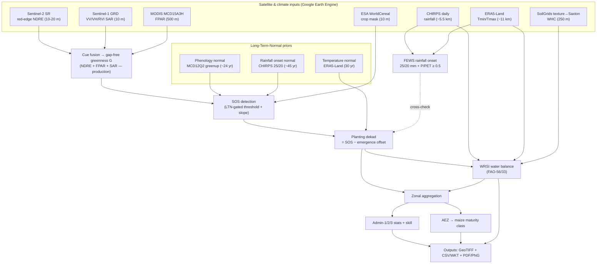
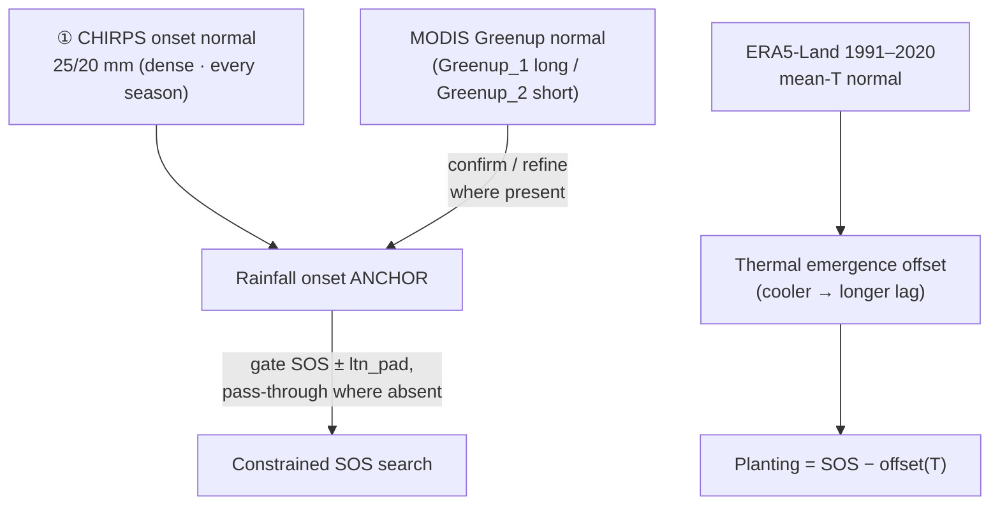
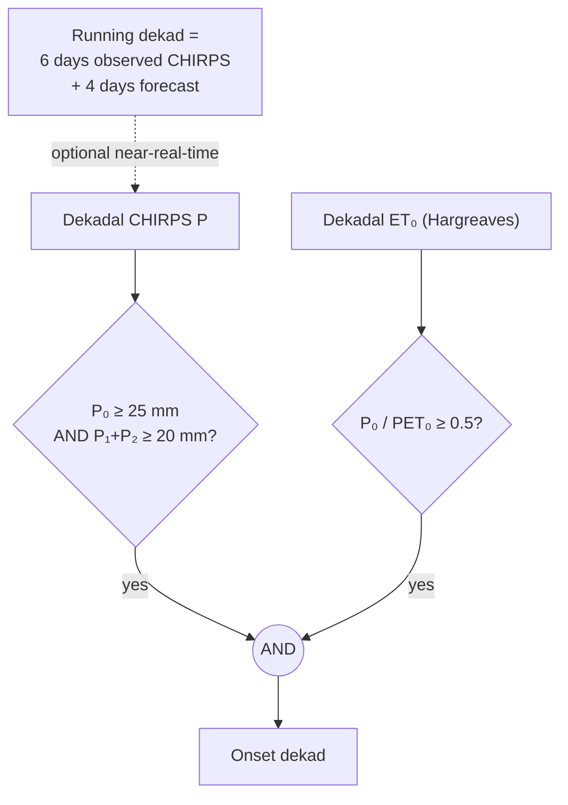
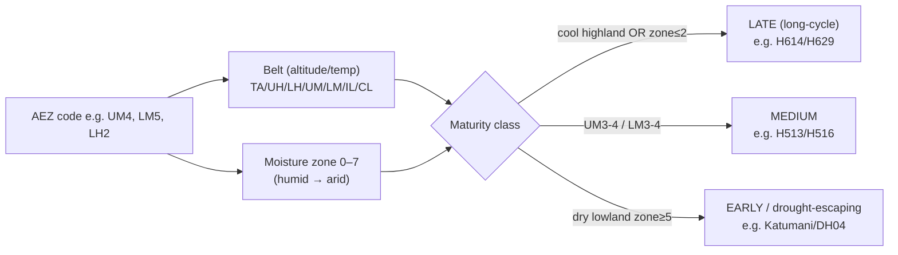

# Crop-Specific Dekadal Planting-Window Estimation — Workflow Documentation

**Region:** Greater Horn of Africa / ICPAC (11 countries) · **Reference implementation:** maize 2024 —
Kenya (Long rains + Short rains) and Ethiopia (Meher, unimodal)
**Engine:** Google Earth Engine (server-side) + local Python post-processing
**Production scale:** 250 m (multi-country operational); 10 m is the reference-quality single-AOI ceiling
**Author/maintainer context:** ICPAC agromet pipeline

---

## 1. Purpose

Estimate the **per-pixel planting dekad** (10-day period, 1–36 in a year) for **maize, teff and wheat**
inside **crop-specific masks**, by fusing **Sentinel-2 red-edge phenology + FPAR + Sentinel-1 SAR**,
constraining the search with **long-term-normal (LTN) climatology**, cross-checking against a
**FEWS-style rainfall onset**, running a **full FAO-56/33 WRSI water balance**, and aggregating to
**administrative units** and **agro-ecological zones (AEZ)**.

A *dekad* is the atomic time step: d1 = days 1–10, d2 = 11–20, d3 = 21–end-of-month; 36 dekads per year.

---

## 2. High-level architecture



---

## 3. Data inputs

| Layer | Dataset (GEE id) | Native res | Role | Reference |
|---|---|---|---|---|
| Optical red-edge | `COPERNICUS/S2_SR_HARMONIZED` | 10–20 m | NDRE onset signal | Eisfelder 2024; Vrieling 2019 |
| Cloud mask | `GOOGLE/CLOUD_SCORE_PLUS/V1/S2_HARMONIZED` | 10 m | clear-pixel gate | — |
| SAR | `COPERNICUS/S1_GRD` | 10 m | cloud-proof gap-fill | Sci. Rep. 2025 (SAR SOS) |
| FPAR | `MODIS/061/MCD15A3H` | 500 m | greenness fusion | Myneni MCD15A3H |
| Phenology LTN | `MODIS/061/MCD12Q2` (Greenup) | 500 m | SOS prior (~24 yr) | (eMODIS pluggable) |
| Rainfall | `UCSB-CHG/CHIRPS/DAILY` | ~5.5 km | onset + WRSI | Funk 2015 |
| Temperature | `ECMWF/ERA5_LAND/DAILY_AGGR` | ~11 km | ET₀ + thermal offset | Muñoz-Sabater 2021 |
| Soil texture | `projects/soilgrids-isric/{sand,clay,soc}_mean` | 250 m | WHC (Saxton–Rawls FC & WP) for WRSI | Poggio 2021; Saxton–Rawls 2006 |
| Crop mask | `ESA/WorldCereal/2021/MODELS/v100` | 10 m | crop-specific stratum | Van Tricht 2023 |
| Forecast (option) | Open-Meteo API / `NOAA/GFS0P25` | ~1–28 km | 4-day forecast rain | — |
| Admin boundaries | GAUL (GEE) + GADM 4.1 (local) | vector | zonal units | — |
| AEZ | Jaetzold/Sombroek Kenya AEZ (local shp) | vector | maturity zonation | Jaetzold & Schmidt (FMHK) |

---

## 4. Stage-by-stage workflow

### 4.1 Optical preprocessing — `src/s2_preprocess.py`

Per dekad, build a cloud-masked median composite of red-edge vegetation indices.

- Cloud Score+ `cs_cdf ≥ 0.60` keeps clear pixels.
- **NDRE1 = (B6 − B5)/(B6 + B5)** — chlorophyll-sensitive red-edge index; less soil noise than NDVI on
  sparse early canopy (better for teff/wheat/early maize). Also NDVI, EVI2, NDRE2, ReNDVI, CIre.
- 20 m red-edge bands are resampled to the analysis grid (nearest, EE default).

### 4.2 SAR preprocessing — `src/s1_preprocess.py`

Dekadal VV/VH/ratio and **RVI = 4·VH/(VV+VH)** in terrain-flattened dB, with a focal-mean speckle
filter in linear space. SAR is **mandatory, not optional**: rainy-season onset coincides with peak
cloud cover, so S1 carries the signal when optical is blind.

### 4.3 Fusion — gap-free greenness `G`

**Production method: cue fusion — `src/fusion_phenometrics.py`.** This is the greenness used for every
operational output. Red-edge NDRE and FPAR are the primary signal on clear dates; SAR-derived greenness
(RVI) fills the remaining cloud gaps.
```
opt_G = mean( unitScale(NDRE), unitScale(FPAR) )
G     = opt_G  filled by  SAR-derived greenness (RVI)  where optical is missing
```

**ubESTARFM was tested as an enhancement and shelved — a documented negative result for onset
(`src/estarfm.py`, `UBESTARFM_FINDING.md`).** Unbiased Enhanced Spatial-Temporal Adaptive Reflectance
Fusion blends fine/sparse Sentinel-2 with coarse/dense MODIS (MCD43A4) into a gap-free series, and was
trialled both as a raw NDVI gap-fill and with an NDVI→NDRE moment-match calibration. At **matched 250 m
resolution** it does not beat cue fusion:

| Fusion variant | Scale | Calendar hit-rate | vs cue @ 250 m |
|---|---|---|---|
| **Cue fusion** | 10 m | **92.7%** | *(reference ceiling)* |
| **Cue fusion** | 250 m | **81.5%** | — |
| ubESTARFM merge (raw NDVI fill) | 250 m | 77.3% | **−4.3 pts** |
| ubESTARFM merge (NDVI→NDRE calibrated) | 250 m | 78.4% | **−3.1 pts** |

*Why it loses:* MODIS has no red-edge, so ubESTARFM can only gap-fill with **NDVI**, which rises earlier
and flatter than NDRE on sparse early canopy and pulls SOS ~1 dekad early. Calibration recovered only
**+1.2 pts** and never breaks even. Denser coverage helps *area completeness* but hurts *onset precision*,
and for onset precision wins. The code is retained for reproducibility and for future canopy-density /
biomass products where NDVI density is itself the goal — but it is **off the planting-window path**.

**The dominant skill lever is resolution, not fusion:** coarsening 10 m → 250 m costs **−11.2 pts**
(92.7 → 81.5), which dwarfs every fusion choice. Because two concurrent 10 m country exports do not
sustain on GEE, **250 m is the operational production scale** for the multi-country rollout; 10 m is the
single-AOI reference ceiling where compute allows.

### 4.4 Long-Term-Normal priors — `src/ltn.py` (unified rainfall-led design)

The start of season is anchored by **rainfall up front** and **confirmed by greenness** — one logic
for both the long and short rains. This *fronts the rainfall caveat* (planting cannot start until rain
supports it) and treats the satellite green-up as a confirmation/enhancement layer, not a hard gate.



- **Rainfall onset (backbone)** — the dense CHIRPS 25/20 mm normal is the anchor; it exists everywhere,
  every season, so a season can never be masked out.
- **Greenness/phenology (confirmation)** — the MODIS greenup normal (`Greenup_1` main / `Greenup_2`
  second season) averages into the anchor **only where present**, sharpening it; pluggable eMODIS 250 m.
- **Pass-through gate** — SOS is constrained to ±`ltn_pad` dekads of the prior *only where a prior exists*;
  where absent the search falls back to the calendar window (so a sparse `Greenup_2` can't reject a whole
  season). `mode='rainfall_led'` is the default; `'phenology_led'` is retained for legacy main-season runs.
- **Temperature LTN** makes the emergence offset spatial: base offset ± round((22 °C − T)/6), clamped 1–3 dekads.

**Season behaviour (measured — see §5b):** where both signals are strong (**long rains**) the prior
adds real skill (**+4.5 pts** calendar hit-rate). Where the signal is intrinsically weak/variable
(**short rains**: sparse `Greenup_2`, noisy onset) the prior keeps the season running but does **not**
sharpen it — the short rains are *confirmation-limited*, an honest data limitation, not a code defect.
The same rainfall-led logic drives **Ethiopia's Meher** (unimodal, Kiremt/JJAS-fed; planting Apr-d1–May-d3),
where a single dominant wet season gives the rainfall anchor a clean onset to lock onto.

### 4.5 SOS detection — `src/fusion_phenometrics.py::detect_sos`

Within the season window (from the crop calendar), intersected with the LTN prior:

> **SOS** = the earliest dekad where `G` crosses `baseline + 25% · amplitude` **and** the dekad-to-dekad
> slope is positive (sustained green-up). Then `updateMask(crop_mask)`.

The crop mask is applied **once, at the SOS output** — the fusion itself runs AOI-wide.

### 4.6 Planting date — `src/planting_date.py`

```
planting_dekad = SOS_dekad − emergence_offset
emergence_offset (dekads): maize 2, wheat 1, teff 1     # planting → detectable green-up, not physical emergence
```
With the temperature LTN on, the offset varies spatially (`ltn.sos_to_planting_thermal`).

### 4.7 FEWS rainfall onset — `src/wrsi_feedback.py`



- **25/20 mm rule** (Senay & Verdin 2003): first dekad ≥ 25 mm, next two dekads ≥ 20 mm.
- **P/PET ≥ 0.5 gate** (new): agroclimatic sufficiency — suppresses spurious onsets in high-evaporative-demand zones.
- **6-obs + 4-forecast dekad** (new, operational): completes the current incomplete dekad with forecast rain
  (Open-Meteo free API, `openmeteo_forecast.py`; or `NOAA/GFS0P25`). Retrospective runs use full observed CHIRPS.

### 4.8 WRSI water balance — `src/wrsi_waterbalance.py`

Full FAO-56/33 dekadal balance, **started at each pixel's detected planting dekad**:

```
ET₀  = Hargreaves(ERA5-Land Tmin/Tmax, Ra(lat, DOY))         # FAO-56 temperature method
WR   = Kc(days-since-planting) · ET₀                          # Kc curve per crop, config/crop_coefficients.yaml
Wb   = SW + P ;  AET = min(Wb, WR) ;  SW = min(Wb − AET, WHC)
WRSI = 100 · ΣAET / ΣWR                                       # + deficit (mm) + FEWS class 1–5
```
Spatial **WHC** from SoilGrids 2.0 texture with field capacity and wilting point both derived by the
Saxton–Rawls (2006) pedotransfer, integrated over the crop root zone (`src/soil.py`; legacy OpenLandMap
builder via `whc_source: openlandmap`).

**WRSI crop-performance classes** (FEWS / GeoWRSI; `classify_wrsi`) — *"good enough" for maize is WRSI ≥ 80; ≥ 95 is no-stress; < 50 is failure*:

| WRSI | Class | Interpretation |
|---|---|---|
| ≥ 95 | 5 | No/very-mild deficit — optimal |
| 80–95 | 4 | **Good** — minimal yield reduction |
| 60–80 | 3 | Mediocre |
| 50–60 | 2 | Poor |
| < 50 | 1 | Crop failure |

*Note: WRSI is a whole-cycle verdict. At the **start** of season, water adequacy is the onset rule (25/20 mm + P/PET ≥ 0.5), not WRSI.* A QGIS style (`wrsi_classes_*.qml`) ships these class breaks.

### 4.9 Zonal aggregation & AEZ maturity

- **Admin-1/2/3** (`src/zonal_aggregate.py`, `admin_skill_local.py`): modal/P10/P50/P90 planting dekad,
  plus **skill vs the FEWS/FAO calendar window** (hit-rate, bias, MAE).
- **AEZ → maize maturity** (`aez_analysis.py`): the Jaetzold AEZ code (temperature belt + moisture zone)
  sets the length of growing period → indicative variety class.



**Key empirical finding (Kenya maize, Long rains 2024):** planting *timing* is nearly uniform across AEZ
(~dekad 9, Mar-d3); the *maturity class* is what varies by zone. So the planting-dekad map shows timing,
the AEZ map shows maturity — they are largely decoupled.

---

## 5. Enhancements added in this work

| Enhancement | File | Effect |
|---|---|---|
| Bug fixes (2-band mask, heterogeneous band types) | `run.py`, `fusion_phenometrics.py` | pipeline runs to completion |
| LTN prior — unified rainfall-led (phenology-confirmed) + temperature offset | `src/ltn.py`, `run.py` | +4.5 pts long-rains hit-rate; short rains kept running but confirmation-limited |
| P/PET ≥ 0.5 onset gate | `src/wrsi_feedback.py`, `run.py` | agroclimatic onset; suppresses false starts in dry zones |
| 6-obs + 4-forecast dekad | `openmeteo_forecast.py`, `export_chirps6.py`, `src/wrsi_feedback.py` | near-real-time onset timeliness |
| ubESTARFM fusion (**tested & shelved**) | `src/estarfm.py`, `UBESTARFM_FINDING.md` | documented negative result: −3 to −4 pts vs cue for onset at matched 250 m; off the production path |
| Statistics + skill | `src/skill_stats.py`, `stats.py`, `skill_graphs.py`, `skill_across_outputs.py` | descriptive + validation-skill + signal-strength + WRSI stats |
| AEZ maturity + influence | `aez_analysis.py`, `aez_influence.py` | maize variety-class zonation |
| WKT attribute tables | `build_wkt_table.py`, `attributes_table.py` | QGIS-ready CSVs with geometry + all attributes |
| Local map/PDF rendering | `render_maps_pdf.py` | maps from GeoTIFFs without GEE compute |
| Notebook + GEE Code Editor demo | `planting_pipeline_kenya.ipynb`, `gee_code_editor_kenya_maize.js` | reproducible, observable runs |

---

## 5b. Validation & key findings

Measured on Kenya maize 2024 (admin-1 ablation vs the FEWS/FAO calendar window):

**LTN prior effect on the start of season** — *tightens the distribution, doesn't move the mean:*

| Season | Baseline hit-rate | + LTN prior | Δ | Pixels retained |
|---|---|---|---|---|
| **Long rains** | 91.4% | **95.9%** | **+4.5 pts** | 100% |
| **Short rains** | 59.8% | 53.4% | −6.4 pts | 78% (unified rainfall-led) |

- **Long rains** — the prior rejects false starts, +4.5 pts hit-rate, MAE −0.09. Signal is strong.
- **Short rains** — the unified rainfall-led prior keeps the season running (78% of pixels vs 0.02%
  under the naïve phenology-led gate), but does **not** sharpen it: the short rains are
  **confirmation-limited** (sparse `Greenup_2`, noisy onset, looser calendar). An honest data limit.

**P/PET onset gate** — negligible in a wet season (long rains onset shifts ≤ +0.1 dekad, only in the
hot/dry Coast & Rift Valley); it is a guardrail for marginal/dry conditions.

**AEZ × WRSI cross-validation** — water satisfaction rises with maturity class exactly as agronomy
predicts, independently confirming the AEZ → maturity logic through the water balance:

| Maturity class | Mean WRSI | Crop-failure % |
|---|---|---|
| Early (dry lowland, short-cycle) | 90.0 | 4.2% |
| Medium | 93.8 | 0.8% |
| Late (humid highland, long-cycle) | 97.1 | 0.0% |

---

## 6. Outputs

- **Rasters (GeoTIFF, Drive):** planting dekad; WRSI + deficit + performance class.
- **Tables (CSV / CSV-with-WKT):** admin-1/2/3 planting distribution + skill; AEZ maturity; per-admin
  attribute table (NDRE/S1/S2/FPAR + LTN normals + SOS/planting). Raster CSV-with-WKT is exported as
  **pixel polygons** (`raster_to_wkt.py --geom polygon`) for a clean QGIS load, plus admin/AEZ polygons.
- **Cartography (PDF/PNG):** planting-dekad maps, WRSI maps + GADM-1/2/3 choropleths, modal-dekad &
  hit-rate choropleths, skill graphs, AEZ-influence figure, agro-climatological calendar (precip/temp/
  greenness LTN + crop stages). Dekad labels shown as `N·Mon` (e.g. `9·Mar`).

---

## 7. Key design decisions

- **Rainfall up front, greenness confirms** — the dense CHIRPS onset is the season-agnostic anchor; the
  satellite green-up confirms and sharpens it. One logic fits both long and short rains without masking.
- **SOS ≠ planting** — planting precedes detectable green-up by a crop-specific offset (satellite lag, ~2 dekads for maize).
- **Red-edge (NDRE) over NDVI** for onset — chlorophyll-sensitive, less soil noise on sparse early canopy.
- **Cue fusion over ubESTARFM** — the red-edge cue is what makes onset clean; fusing in a broadband NDVI
  (all MODIS offers) only pulls SOS early. Spend compute on **resolution**, not on spatiotemporal fusion.
- **SAR is mandatory** — rainy-season onset = peak cloud; S1 carries the signal.
- **LTN prior gates the search** — rejects weeds / second-flush false starts.
- **WRSI runs entirely in GEE** — no GeoWRSI hand-off; planting dekad feeds the water balance as SOS.

---

## 8. Caveats

- Reference implementation for a GEE environment; requires authenticated access + crop-specific mask assets.
- Calendar windows in `config/season_calendar.csv` are **indicative** — calibrate against FEWS NET / FAO
  GIEWS / GEOGLAM before operational use.
- Smallholder mixed pixels blur SOS; the finest native resolution the compute budget allows is the best
  remedy (resolution is the dominant skill lever — see §4.3). ubESTARFM was tested for this and does **not**
  help onset; Planet 3 m or native-10 m S2 are the levers that do.
- AEZ maturity mapping is a first-order Jaetzold convention — calibrate against Kenya Seed variety zonation.
- Ward-level (admin-3) statistics from downsampled mosaics are approximate; use native-resolution zonal
  stats for publication.
- Full LTN+WRSI at 10 m is compute-heavy and does not sustain for two concurrent country exports (both
  10 m runs failed after 2+ days on GEE) — **250 m is the production scale**; reserve 10 m for single-AOI
  reference runs on a paid/commercial project. The CHIRPS-onset LTN defaults to a recent ~10-yr window
  (widen for a longer climatology if compute allows).
- **Second/short rains are confirmation-limited.** MODIS `Greenup_2` is sparse and the short-rains onset
  is noisy, so the LTN prior keeps the season running (rainfall-led) but cannot sharpen it as it does the
  long rains. Treat short-rains planting dates as indicative; lean on the rainfall onset there.
- The CHIRPS-onset LTN is anchored on rainfall; where it is masked (short-rains dry pixels) the SOS search
  falls back to the calendar window — do not over-interpret the prior in those areas.

---

## 8b. In-season risk monitoring & the GDD phenology clock (maize)

Beyond the once-per-season planting window, the pipeline now carries an **in-season monitoring** layer
— ASAP-style (JRC), **stage-weighted** on a **GDD phenology clock**. Maize only for now.

**GDD phenology clock — `src/gdd_clock.py`, `run_gdd.py` (thermal branch).** Reuses the pipeline's
in-GEE SOS as the emergence anchor and accumulates GDD from **ERA5-Land daily air Tmax/Tmin,
DEM-lapse-corrected to SRTM 30 m** (elevation drives the fine signal). `GDD_maturity` is **AEZ-seeded
per pixel** (early 1300 / medium 1500 / late 1700 °C·d). It predicts four **stage-transition dekads
per pixel** — `peak_vegetative` (0.45) · `flowering` (0.55) · `grain_filling` (0.65) ·
`maturity` (1.00, end of season). Dates are fully **pixel-specific** (SOS + lapsed-temperature +
AEZ all vary per pixel): e.g. flowering spans a ~17-dekad range *within a single county* in the Rift
highlands. Authoritative spec: `GDD_Phenology_Clock_Workflow.docx` (v2.1); the split reserves the
**photoperiod branch** for landrace sorghum/pearl millet (not GDD).

**Risk layers — `src/spi.py`, `spi_admin.py`, `risk_app.html`.** Per-pixel climatological anomalies,
persistence-checked, masked to maize (**CAF**), aggregated to admin by **% of crop area affected**
(ASAP **25 / 50 / 75 %** → Watch / Alert / Critical). Live: **SPI-3** meteorological drought
(CHIRPS 1981–2020, Wilson–Hilferty gamma) and **WRSI crop-failure %**; the stage-weighting applies
FAO-33 **Ky** (vegetative 0.4 · flowering 1.5 · grain-fill 0.5) on the clock's intervals, so an
anomaly at silking counts ~3–4× one during vegetative growth. Full spec + roadmap (heat, VCI, CPI):
`RISK_MONITORING_DESIGN.md`. Explore in the **2024 Maize Risk Monitor** (`risk_app.html`).

> **Algorithms + citations.** Every step of both the planting-window estimator and the GDD
> stage-weighted risk monitor — the equations and the reference that justifies each — is set out in
> **`ALGORITHMS_AND_REFERENCES.md`** (39 numbered citations; also `.html` / `.docx`).

---

## 9. References

**SOS / SAR–optical fusion**
1. Van Tricht, K. et al. (2023). *WorldCereal.* Earth Syst. Sci. Data 15, 5491–5515. https://doi.org/10.5194/essd-15-5491-2023
2. Eisfelder, C. et al. (2024). *Cropland & Crop Type with S1/S2 in GEE, Ethiopia.* Remote Sensing 16(5):866. https://doi.org/10.3390/rs16050866
3. (2025) *S1 SAR annual rice area & long-term SOS dynamics.* Sci. Reports. https://doi.org/10.1038/s41598-025-91655-z
4. Vrieling, A. et al. (2019). *S1 & S2 time series for meadow phenology.* Remote Sensing 11(5):542. https://doi.org/10.3390/rs11050542
5. (2026) *PlanetScope + S2 fusion for maize phenometrics.* GIScience & Remote Sensing. https://doi.org/10.1080/15481603.2026.2637207

**WRSI / water balance / onset**
6. Verdin, J. & Klaver, R. (2002). *Grid-cell crop water accounting for FEWS.* Hydrol. Processes 16, 1617–1630. https://doi.org/10.1002/hyp.1025
7. Senay, G.B. & Verdin, J. (2003). *GIS crop water balance, Ethiopia.* Can. J. Remote Sensing 29(6), 687–692. https://doi.org/10.5589/m03-039
8. Funk, C. et al. (2015). *CHIRPS.* Scientific Data 2:150066. https://doi.org/10.1038/sdata.2015.66
9. Allen, R.G. et al. (1998). *FAO-56 Crop evapotranspiration.* FAO Irrigation & Drainage Paper 56. https://www.fao.org/3/x0490e/x0490e00.htm
10. Hargreaves, G.H. & Samani, Z.A. (1985). *Reference ET from temperature.* Appl. Eng. Agric. 1(2), 96–99. https://doi.org/10.13031/2013.26773
11. Muñoz-Sabater, J. et al. (2021). *ERA5-Land.* Earth Syst. Sci. Data 13, 4349–4383. https://doi.org/10.5194/essd-13-4349-2021

**FPAR / phenology**
12. Myneni, R. et al. *MODIS MCD15A3H FPAR/LAI C6.1.* NASA LP DAAC. https://doi.org/10.5067/MODIS/MCD15A3H.061

**Regional monitoring / calendars / statistics**
13. Becker-Reshef, I. et al. (2020). *GEOGLAM Crop Monitor for Early Warning.* RSE 237:111553. https://doi.org/10.1016/j.rse.2019.111553
14. Lee, D. et al. (2025). *HarvestStat Africa.* Scientific Data. https://doi.org/10.1038/s41597-025-05001-z
15. FEWS NET crop calendars & data portal. https://fews.net/data
16. FAO GIEWS Country Briefs. https://www.fao.org/giews/
17. Jaetzold, R. & Schmidt, H. *Farm Management Handbook of Kenya* (agro-ecological zones). Ministry of Agriculture, Kenya.

**Spatiotemporal fusion (ubESTARFM)**
18. Zhu, X. et al. (2010). *ESTARFM — enhanced spatial and temporal adaptive reflectance fusion.* RSE 114(11), 2610–2623. https://doi.org/10.1016/j.rse.2010.05.032

*Verify DOIs against your library before formal publication; the 2023–2026 fusion papers were surfaced via web search.*
